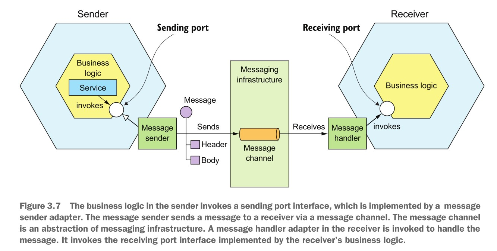
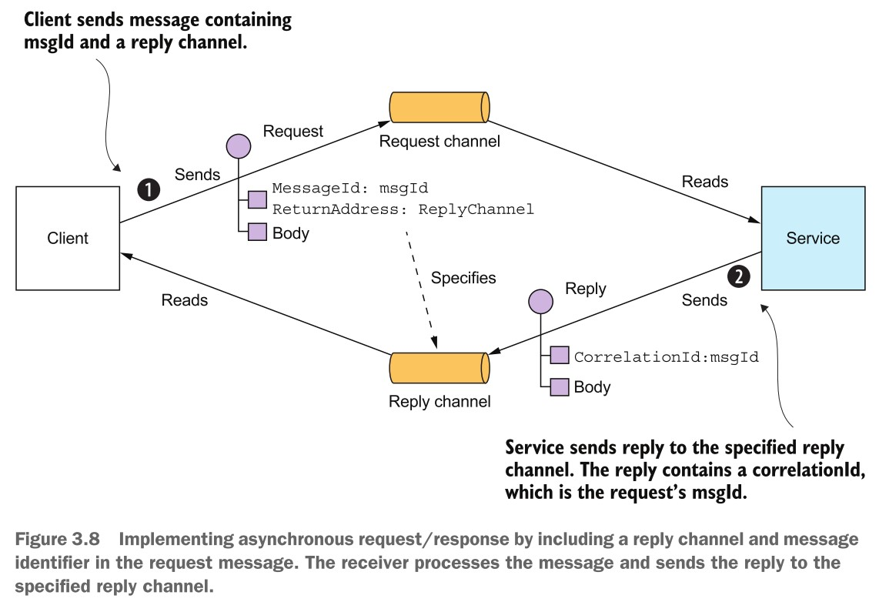

# 微服务开发

[toc]

## 服务间通信：API

* 单块应用
  * 运行在同一个进程中，直接使用函数调用进行通讯
  * 需要与其他应用集成时，采用 REST Api 进行通讯
* 微服务应用
  * 被分解出来的服务之间需要协作
  * 分布式环境下，协作会跨主机、跨进程
  * 当前最流行的进程间通信方式是 REST
  * 服务间的通信方式对于应用的可用性至关重要
* 可选项
  * 同步通信：如基于HTTP的 REST 和 gRPC
  * 异步通信：如基于消息的的 AMQP 和 STOMP
  * 通信内容类型：
    * 基于文本：JSON、XML
    * 基于字节：Avro，Protocol Buffers
* 微服务的API 可发为两类
  * 操作：由客户端调用，包括名字，参数，返回类型
  * 事件：包括类型和字段集，发布到消息通道（Message Channel）
* 跟单块应用不同，编译期无法发现微服务 API 的问题，只有在运行期才能发现
* 最佳实践
  * 使用某种接口定义语言（IDL）对服务接口进行定义，如 Swagger
  * API-First：先定义 API，再进行开发
* 微服务 API 的演进
  * 当加入新功能时，或功能变更时，API 需随着时间而演进
  * 不应该，也不可能强制所有调用者同步更新
  * 应采用滚动升级（Rolling Update），确保新旧版本同时在线
  * 当所有调用者都完成升级后，再撤回旧版本

### 同步通信: 使用REST API

* 资源的定义、URI标识符（一对多）、表示（JSON），操作/Http动词（请求方式），状态码
* [REST成熟度模型](http://martinfowler.com/articles/richardsonMaturityModel.html)
  * 0级：没有资源概念。使用一个 URI 处理所有请求，请求内容封装在请求体中
  * 1级：引入资源概念，一个资源的所有操作都通过一个URI完成
  * 2级：引入HTTP动词，资源的不同操作使用适当的HTTP动词和返回状态码
  * 3级：实现HATEOAS原则 ，不仅返回当前的资源表示，还返回后续操作的链接，使客户端无须再执行硬编码URI。（注：这才是真正的RESTful，但实际中很少能做到）
* 使用 [Open API 规范](www.openapis.org) 描述 API
* 缺点：
  * 无法一次操作获取多个对象
  * 返回太多无用的信息
  * 解决办法：[GraphQL](http://graphql.org)

### 同步通信: 使用gRPC API

* 二进制的基于消息的协议
* 使用 基于Protocol Buffer协议进行描述
* 使用Protocol Buffer生成客户端桩（Stub）和服务器端骨架（skeleton）
* 使用 HTTP/2

### 同步通信: 断路器模式（Circuit breaker pattern）

* 问题：当请求的服务总是超时，怎么办？

* 目标：零延时

* 当一个服务的请求连续出现超时，并且连续超时的次数超过某个阀值时，则再次请求该服务时会被断路器直接拒绝，而不会发出真正的请求。

* 以下内容来自网络

  * 如果调用失败，将失败值的增加1

  * 如果调用失败的次数超过某个阈值，就打开电路

  * 如果电路处于打开状态，则立即返回错误信息或返回一个默认值

  * 如果电路处于打开状态且已经过了一段时间，则半开电路

  * 如果电路半开，下一次请求调次失败，请再次打开

  * 如果电路半开，下一次请求调用成功，请将其关闭

    作者：water_lang
    链接：https://www.jianshu.com/p/f6d280df6340
    来源：简书
    著作权归作者所有。商业转载请联系作者获得授权，非商业转载请注明出处。

* 断路器可部署在 API 网关上
  
  * 网关返回缓存数据，或直接错误数据
  
* 开源实现：[Hystrix for JVM](https://github.com/Netflix/Hystrix) 、[Polly for .NET](https://github.com/App-vNext/Polly)、[Spring Cloud Hystrix](https://spring.io/projects/spring-cloud-netflix)

* 基础设施实现：[Kubernetes + Istio](https://istio.io/docs/tasks/traffic-management/circuit-breaking/)

### 同步通信: 服务发现模式

* 发送消息前，如何知道目标服务的网络位置，如IP和端口？
  * 我们现在的做法（最差）：硬编码
  * 传统做法：从配置文件中获取
  * 微服务：因为要满足扩展性，目标服务可能会动态增减，因此目标IP地址是动态的
* 必须提供一个动态的服务发现机制
  * 提供服务注册组件，管理所有服务实例的网络位置信息
  * 当服务实例启动或停止时，会更新服务网络数据
  * 注册中心会定期轮询服务实例其健康状态，因此服务实例也要提供类似API
  * 客户端向服务注册中心询问服务的网络信息，得到回复后发出请求
* 两种实现：
  * 服务及其客户端直接与服务注册中心交互
    * 自我注册模式：服务实例启动或停止时，自动更新注册中心
    * 客户端发现模式：客户端从注册中心获取所有可用服务实例及其负载均衡配置
    * [spring cloud netflix](https://spring.io/projects/spring-cloud-netflix)
  * 通过基础设施完成：Kubernetes
    * 第三方注册模式：服务实例由第三方自动注册
    * 服务器端发现模式：客户端向路由器发送请求，后者负责服务发现
    * 虽然与基础设施耦合，但还是推荐（因为不用写代码）

### 异步通信：使用异步消息模式

* 一个基于消息的应用，通常被称为消息代理（message broker）
  * 作为服务通信的中介
  * 通信过程：
    * 客户端发送一条消息到代理
    * 服务从代理中读取消息
    * 服务进行处理并将结果封装成一条消息
    * 服务将消息发回给代理
    * 客户端从代理读取返回的消息
    * 客户端根据消息进行处理
  * 以上过程是异步的
    * 客户端发完消息后，并不会等着消息的返回
    * 客户端不需要知道服务的网络信息
    * 服务端不需要知道客户身份信息
* **消息模式：客户端通过异常消息调用服务**

#### 消息

* 案例：使用 [Spring Integration](https://spring.io/projects/spring-integration) 开发一个 hello world 例子

* 消息模型

  * 出处： [Enterprise Integration Patterns][1] 
  * 消息通过消息通道（message channel）进行交换
  * 发送者往通道上发送消息
  * 接收者从通道接收消息

* 消息

  * 由消息头（header）和消息体（body） 构成
  * 消息头包括：
    * 一组键值对
    * 消息的元数据
    * 消息id
    * 消息返回地址：返回消息的通道
  * 消息体是消息要发送的数据，可以是文本或二进制类型

* 三种消息类型

  * 文档：只包含纯数据
  * 命令：指定操作和参数
  * 事件：指出发送者发生的事件，如下订单

* 消息通道

  

* 消息通道类型：点对点，订阅-发布式

* 可以实现同步的消息通信，但这种场景选用 REST 

* 异步请求/响应，或异步点对点

* 单向通知：只请求，没响应
* 订阅-发布：多个服务从通道中获取消息并处理

### 设计基于消息的API

* 