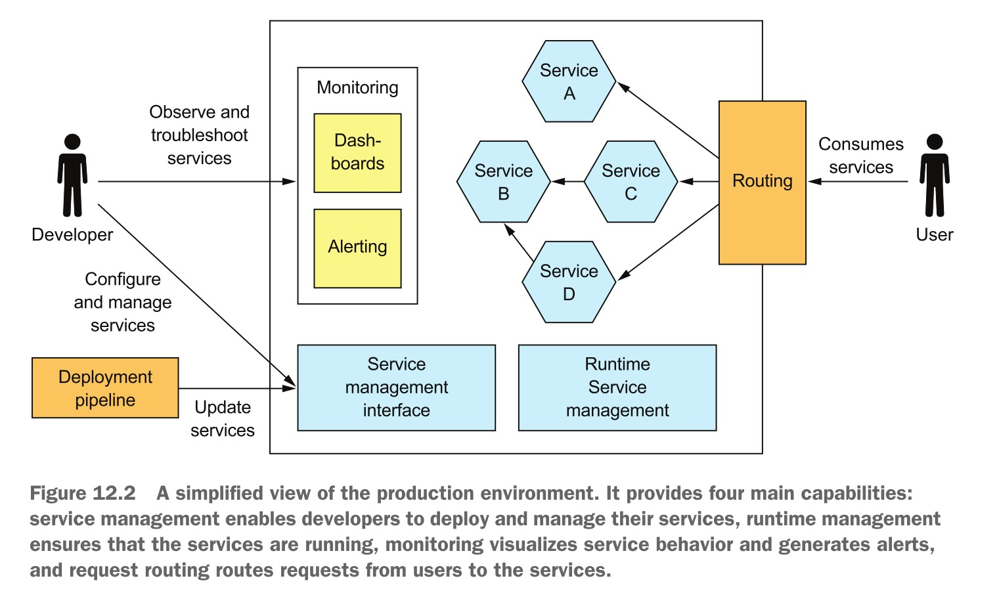
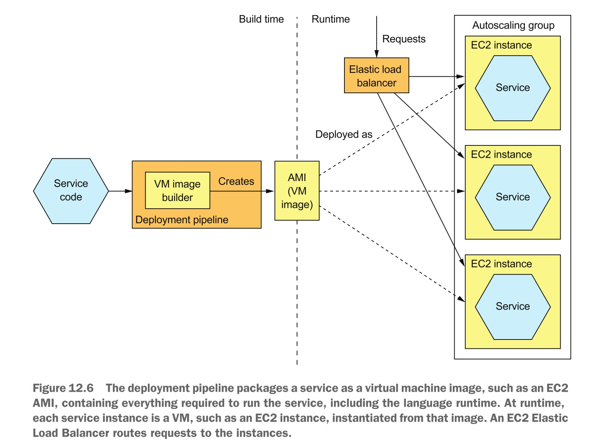
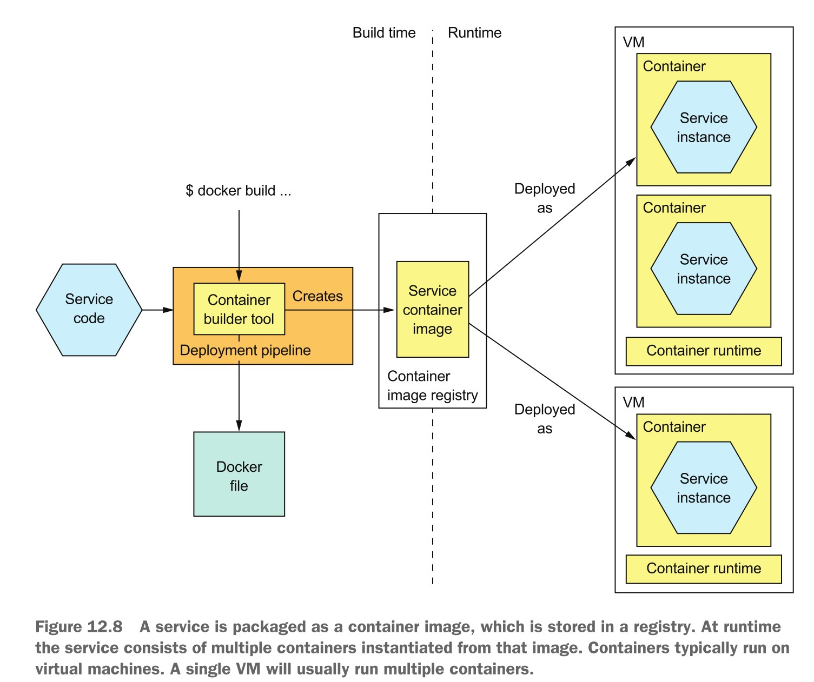

# 微服务部署

[toc]

* **缺少服务发现，断路器模式**
* 传统部署需要开发人员和运维人员的共同努力

* 当前，很多公司都在推行DevOps运动，
  * 开发与运维的界限正在消失
  * 开发团队要负责应用的部署
  * 兴起的容器云和Serverless架构技术降低了运维的门槛
  * 反过来说：微服务包含很多小的服务，对于运维团队过度复杂

## 产品环境

* 一个产品环境必须 实现四个关键能力
  * 服务管理接口：开发人员能够创建、更新、配置服务。一般为 REST API
  * 运行时服务管理：确保预期数目的服务实例永远处于运行状态
    * 如果有宕机的，必须能自动重启
    * 根据负载自动增减服务数量
    * 负载均衡
  * 监控：开发人员能够看到服务的状态，包括日志文件和性能指标
  * 请求路由：必须能为用户提供访问支持

## 使用特定包格式部署：如WAR，EAR等

* 好处
  * 快速部署：直接往 Tomcat 部署目录里一扔就可以实现热部署
  * 有效资源利用：共享同一个Tomcat部署多个应用
* 坏处：对于复杂应用，不建议这样部署。
  * 缺乏技术栈的封装：A服务需要JDK1.7，B服务需要JDK1.8，没法做到兼顾
  * 不能限制服务的资源利用，极端情况下一个服务会用光所有的资源 
  * 在同一台机器上运行的服务缺乏隔离，一个服务的崩溃会影响到其他的服务
  * 无法自动评估硬件服务器过载与否

## 部署服务到虚拟机

* 本地虚拟机：VMWare， Virtualbox，阿里云服务器

* 好处
  * 虚拟机封装了技术栈
  * 虚拟机隔离了服务实例
  * 成熟的云技术
* 坏处
  * 资源利用率不高：虚拟机很占存储
  * 部署效率较低：创建虚拟机，启机虚拟机很花时间
  * 系统管理难度大：系统管理得针对操作系统打补丁，很多地方需要人工管理环境

## 部署为容器

* 编写应用并打包：app-service.jar

* 编写Dockerfile

  

* 构造镜像：docker build -t app-service .

* 发布镜像： docker push

* 运行容器：docker run 

  

* 容器其他操作：
  * 查看：docker ps
  * 停止：docker stop
  * 删除：docker rm
* 镜像操作
  * 查看：docker images
  * 删除：docker rmi <id>
  * 构造：docker build
  * 拉取：docker pull
  * 发布：docker push
  * 打标签：docker tag
* 好处
  * 封装了技术栈
  * 服务实例相互隔离
  * 服务实例使用资源受限
* 坏处：
  * 需要维护镜像，为操作系统打补丁

## 部署到Kubernetes（K8S）

* K8S是一个Dockers编排框架：管理运行在集群中各节点上的Docker容器

  * 资源管理：将一个集群视为CPU，内存，网络，存储等构成的资源池，将集群中的所有机器变成一台机器进行管理
  * 调度：选择集群中合适的节点运行容器。
    * 亲和力（affinity）：可以将容器部署到同一机器上
  * 服务管理
    * 为服务命名及提供版本支持
    * 自动提供部署所需的服务实例的数量 
    * 自动提供负载均衡
    * 提供蓝绿部署
    * 提供滚动升级

* K8S结构

  

  * 节点：集群中的机器。分为master节点和工作节点
  * 主控节点：
    * API服务器：提供REST API用于部署服务，常用 kubectl 命令行工具进行交互
    * Etcd：存储集群信息和服务数据 
    * 调度器：为容器选择节点
    * 控制器管理器：控制集群的状态，保证各运行的服务正常运行
      * 当某个节点断电失陪后，将自动在其他节点上启动该节点上的容器
  * 工作节点：
    * Kubelet：创建和管理运行在节点上的POD
    * Kube-Proxy：管理网络，包括跨POD的负载均衡
    * PODs：服务的运行形态
  * K8S重要概念（资源）
    * Pod：K8S中最基本的部署单元，是一台逻辑上的机器
      * 可包含一个或多个容器，这些容器共享相同的网络和存储
      * 但通常只包含一个容器
      * 有时会包含 sidecar 容器
        * 一个 Nginx 容器提供服务
        * 另一个容器下载最新版本的服务
    * 部署（Deployment）：一个POD的定义规范。描述服务实例的个数，支持滚动升级
      * 每个服务在运行时对应着一个Deployment
  * 服务（Service）：为客户端提供静态的网络位置
    * 运行服务的容器的IP是经常变化的，
    * 一个服务可与服务的所有容器进行关联
    * 服务的DNS和IP是所有容器共享的
  * ConfigMap：命名的字典用来定义服务的配置
    * 在定义POD时被引用
    * 可用来在容器内部创建配置文件
    * 用来存储密码等机密信息的ConfigMap称为Secret

* 部署过程

  * 编写代码并构建，生成 Spring Boot 应用的 jar 包

  * 生成 Docker 镜像，并上传到 仓库中

  * 定义并在集群上创建 Deployment ：kubectl apply -f ftgo-restaurant-service.yml

    

  * 定义并在集群上创建Service：kubectl apply -f ftgo-restaurant-service

    

  * 为运行微服务的一个或多个POD提供一个稳定的IP地址，但这个IP地址集群内部的地址，外网是不可见的

* 部署一个 API 网关：创建外网可见的Service

  * 使用NodePort类型的服务：显露的是物理节点的端口（3000~32767）

  

* 滚动升级：从v1版本升级到v2版本
  * 零宕机升级
  * 构造新版本的镜像并发布到仓库
  * 执行命令：kubectl apply -f 。。。升级Deployment
  * 可使用命令回滚：kubectl rollout undo deployment <deployment-id>

## 使用 Serverless 部署模式

* 只需要实现功能，不需要创建镜像，容器，完全不需要运维人员（系统管理员）
* 函数式编程：Java Lambda

